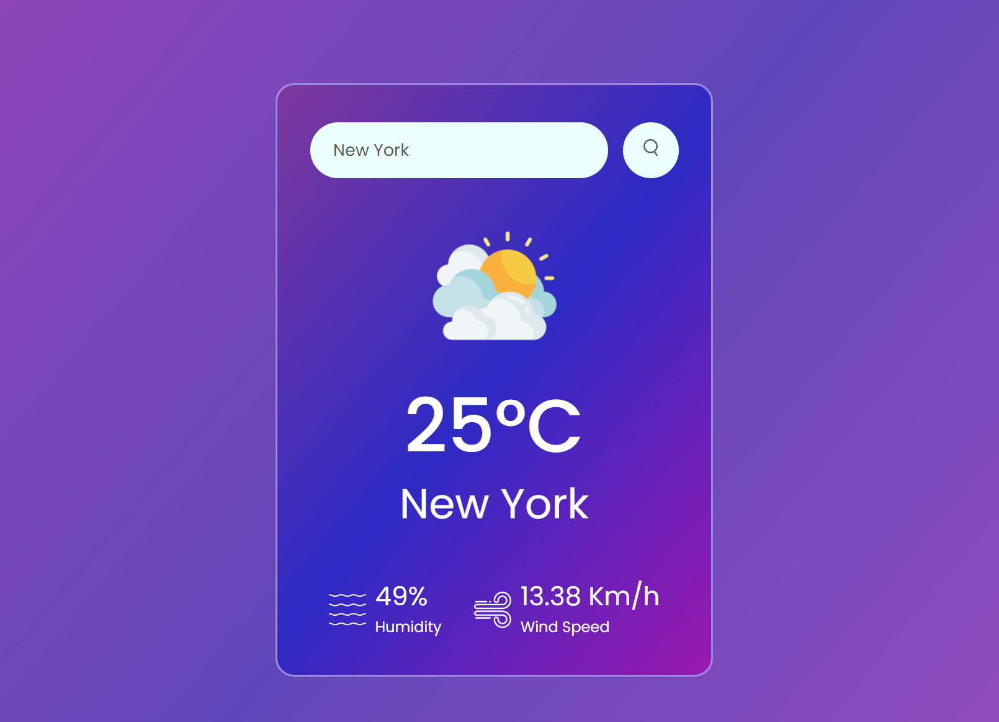

<h1> Day 1 - Weather App</h1>

Difficulty - Easy :star:

This is a mini weather app built with HTML, CSS, and JavaScript. 

<h3>Features</h3>
 - Search City 
    | 
    |- If the city is not found must return "City Not Found." 
    | 
    |- If it is found, then display weathre status in that city [Temprature, Humidity and Wind speed] 

 - It must have a beautifyl UI

<a href="https://basicfrontend.netlify.app/day%201%20weather%20app/">Demo</a> | <a>Repo</a>
