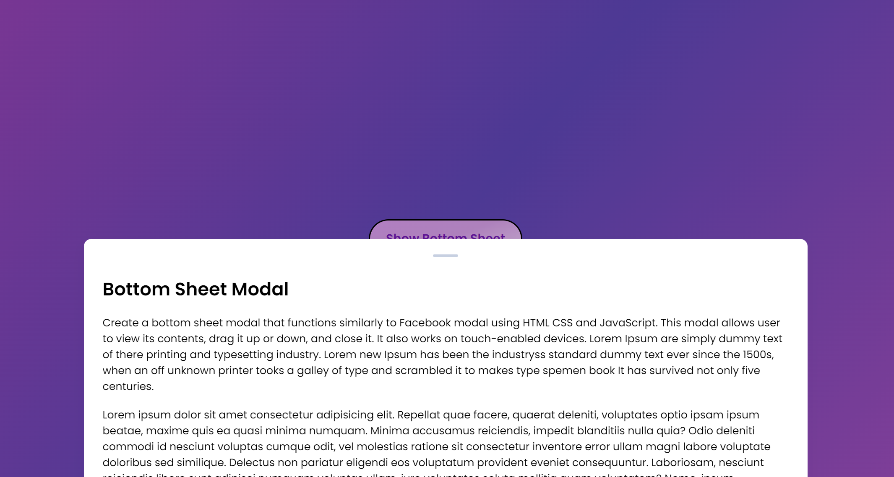

<h1> Day 26 - Dragable Bottom Sheet Modal</h1>

Difficulty - Easy :star:

This is a dragable bottom sheet modal built with HTML, CSS, and JavaScript. 

<h3>Features</h3>
 - Triggered by a button click  
 - displayed at the bottom of the page 
 - Scrollable and dragable to resize it 
 - It must have a beautifyl UI 

<a href="https://basicfrontend.netlify.app/day%2026%20dragable%20bottom%20sheet%20modal/">Demo</a> 

