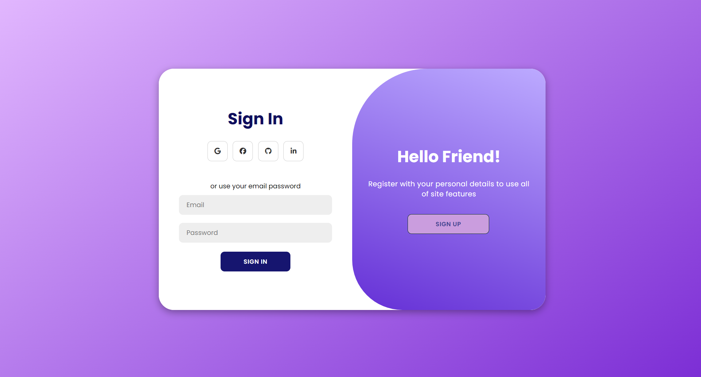

<h1> Day 5 - Login | Register Page</h1>

Difficulty - Easy :star:

This is a basic Login | Register page with switch built with HTML, CSS, and JavaScript. 

<h3>Features</h3>
 - Displays a login page with a prompt to accept username and password from user  
 - When login page is displayed Register button is shown  
 - When Sign up is clicked switches to a register page and display to the user a prompt to accept registration details  

 

<a href="https://basicfrontend.netlify.app/day%205%20login%20and%20register%20page/">Demo</a> 

