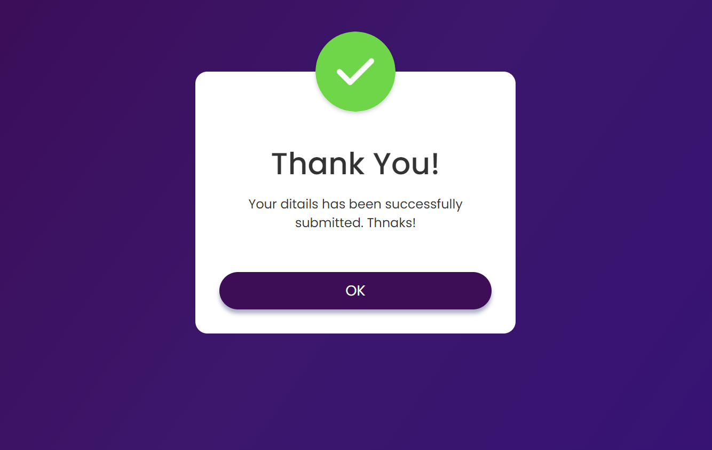

<h1> Day 7 - POP UP Message</h1>

Difficulty - Easy :star:

This is a Popup display built with HTML, CSS, and JavaScript. 

<h3>Features</h3>
 - trigering button
 - Popup window like a success message when the button is closed

 

<a href="https://basicfrontend.netlify.app/day%206%20image%20gallery/">Demo</a>