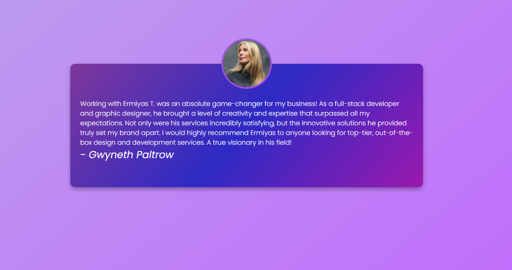

<h1> Day 8 - Testimonial Slider</h1>

Difficulty - Easy :star:

This is a Testimonial Slider built with HTML, CSS, and JavaScript. 

<h3>Features</h3>
 - Dynamic Content
 - Automatic Switch
 - Beautiful UI

 Manual controler and indicator dots will be added

 

<a href="https://basicfrontend.netlify.app/day%208%20testimonial%20slider/">Demo</a>