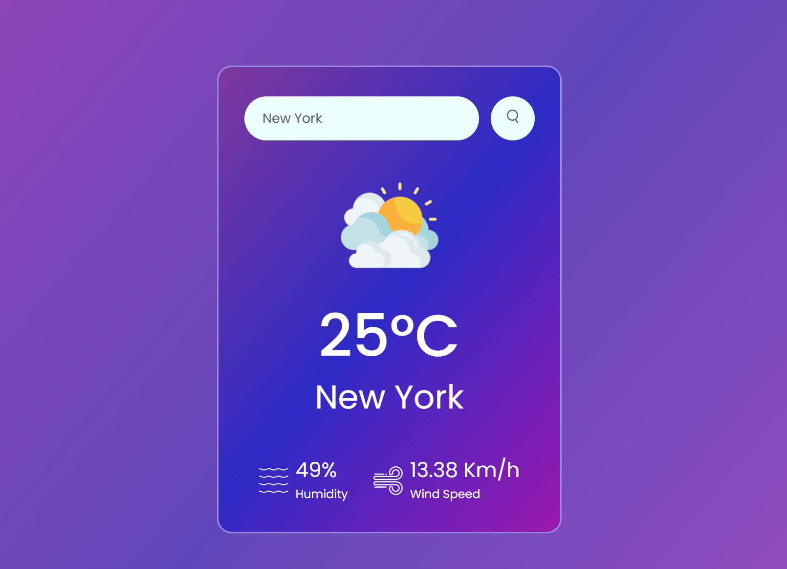
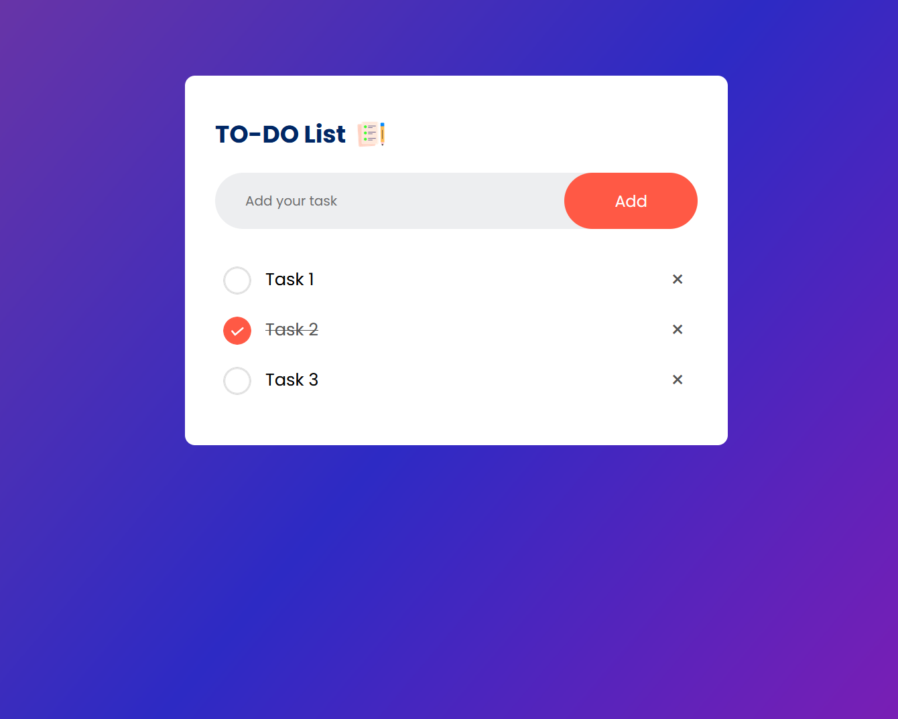
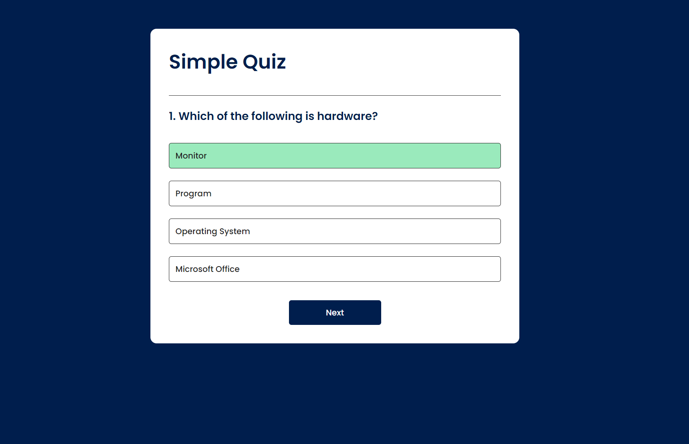
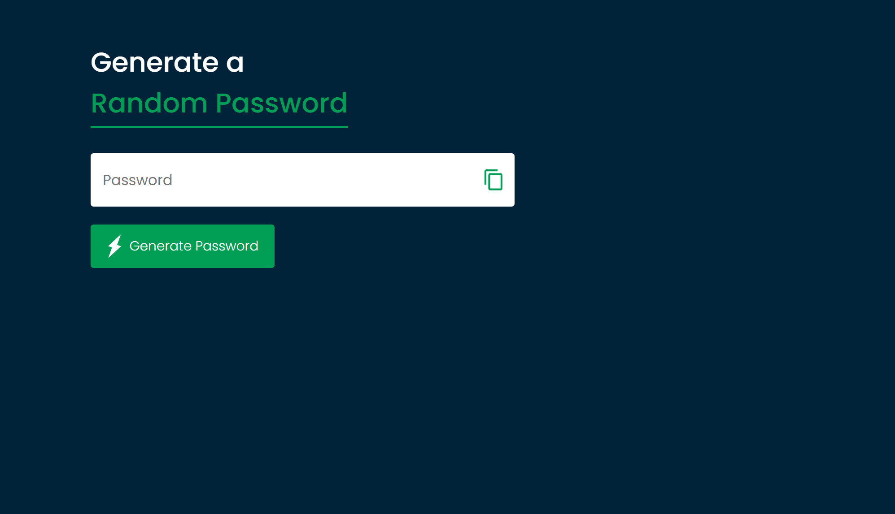

# Front-End Fundamentals Practice Repository

This repository created to practice the core and basic principles of front-end development, including HTML, CSS, and JavaScript. Work through a series of exercises designed to solidify your understanding and build practical skills in 30 days. 

This repo is beneficial to:
  - Front-end Newbeie
  - Brush-up Enthusiasts
  - Interactive Learners

find the complete list of demos for all the projects at: https://basicfrontend.netlify.app/

Feel free to contribute!

# COMPLETE PROJECTS

<h1> Day 1 - Weather App</h1>

Difficulty - Easy :star:

This is a mini weather app built with HTML, CSS, and JavaScript. 

<a href="https://basicfrontend.netlify.app/day%201%20weather%20app/">Demo</a> | <a href="https://github.com/Erma-T/30daysFrontEndBasic/tree/main/Day%201%20Weather%20APP">Repo</a>

<h1> Day 2 - TO-DO App</h1>

Difficulty - Easy :star:

This is a To do app built with HTML, CSS, and JavaScript. 

<a href="https://basicfrontend.netlify.app/day%202%20todo%20app/">Demo</a> | <a href="https://github.com/Erma-T/30daysFrontEndBasic/tree/main/Day%202%20TODO%20App">Repo</a>

<h1> Day 3 - Quiz App</h1>

Difficulty - Easy :star:

This is a basic quiz app built with HTML, CSS, and JavaScript. 

<a href="https://basicfrontend.netlify.app/day%203%20quiz%20app/">Demo</a> 

<h1> Day 4 - Random Password Generator App</h1>

Difficulty - Easy :star:

This is a random password generator app built with HTML, CSS, and JavaScript. 

<a href="https://basicfrontend.netlify.app/day%204%20random%20password%20generator/">Demo</a> | <a href="https://github.com/Erma-T/30daysFrontEndBasic/tree/main/Day%204%20Random%20Password%20Generator">Repo</a>

<h1> Day 5 - Login | Register Page</h1>

Difficulty - Easy :star:

This is a basic Login | Register page with switch built with HTML, CSS, and JavaScript. 
 

<a href="https://basicfrontend.netlify.app/day%205%20login%20and%20register%20page/">Demo</a>  | <a href="https://github.com/Erma-T/30daysFrontEndBasic/tree/main/Day%205%20Login%20and%20Register%20Page">Repo</a>

<h1> Day 6 - Image Gallery</h1>

Difficulty - Easy :star:

This is a basic Login | Register page with switch built with HTML, CSS, and JavaScript. 
 

<a href="https://basicfrontend.netlify.app/day%205%20login%20and%20register%20page/">Demo</a>  | <a href="https://github.com/Erma-T/30daysFrontEndBasic/tree/main/Day%205%20Login%20and%20Register%20Page">Repo</a>
